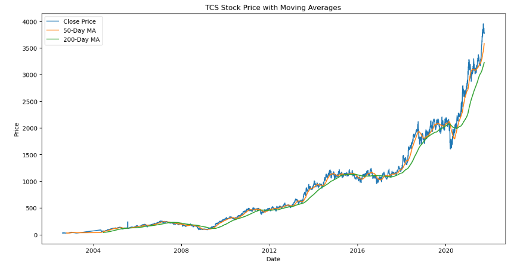
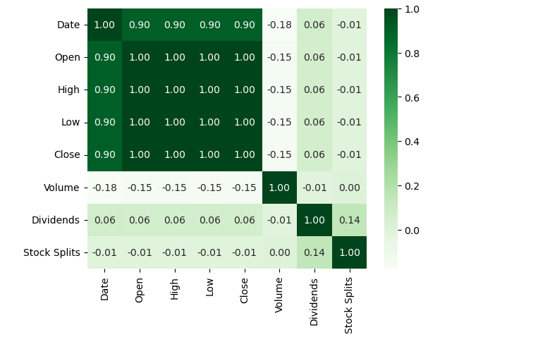
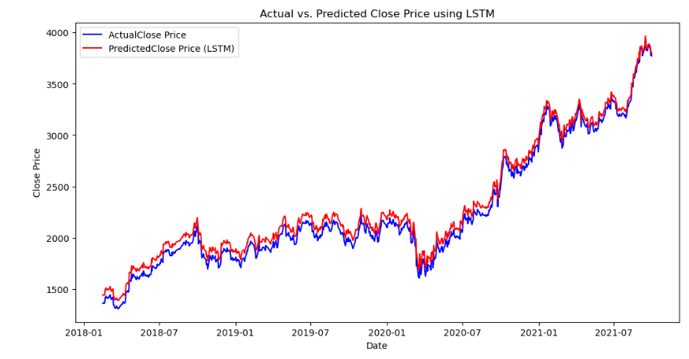

# TCS Stock Price Prediction

This project focuses on predicting the stock prices of TCS (Tata Consultancy Services) using machine learning techniques. The dataset contains historical stock prices from 2002 to 2021, including features like `open`, `high`, `low`, `close`, and `volume`.

## Objective

The objective of this project is to predict future stock prices based on historical data using machine learning algorithms. The project uses techniques such as:
- **Random Forest Regressor** for non-linear price prediction.
- **LSTM (Long Short-Term Memory)** model for time-series forecasting.

## Dataset

The dataset consists of the following columns:
- **Date**: The date of the stock record (2002-2021).
- **Open**: The price at which the stock opened.
- **High**: The highest price during the day.
- **Low**: The lowest price during the day.
- **Close**: The price at which the stock closed.
- **Volume**: The number of stocks traded.

## Key Features
- **Data Preprocessing**: Missing data handling, feature extraction, and date parsing.
- **Model Building**: Implementing machine learning models for price prediction.
- **Evaluation**: Using metrics like Mean Absolute Error (MAE), Mean Squared Error (MSE), and R-squared to evaluate model performance.

## Screenshots

